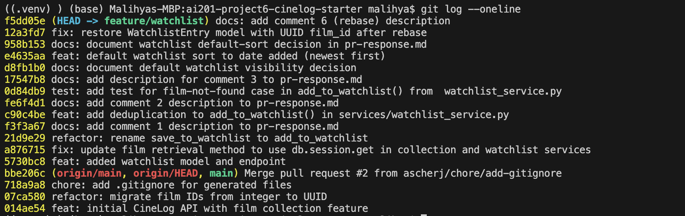

# PR Response Doc — CineLog Watchlist Feature

## AI Usage
I used Claude Code to stress-test my design arguments for Comments 4 and 5, and to verify the refactor logic alongside running pytest. For Comment 4, I asked what a careful reviewer would push back on and how to make my privacy argument specific to CineLog, which pushed me to ground it in what a watchlist actually reveals about a user rather than a generic privacy claim. For Comment 5, I asked what counterargument a reviewer would raise, which surfaced the tradeoff that newest-first sorting can bury older films and led me to drop a UI-based suggestion in favor of a sort parameter since the app is API-only. In both cases the final position and reasoning are my own — the AI mainly exposed gaps and tradeoffs I then argued through myself. I also used AI to write a short script that exercised the deduplication and UUID logic directly, which I confirmed by running the full pytest suite. Claude Code was also used to create the PR description, however I made sure to look it over and suggest what to add and what to remove. 


## Comment 1 — Rename
**What I did:** I used the Cmd+Shift+F command to find all instances of save_to_watchlist. I then went through each one and changed it to add_to_watchlist

**How I verified:** I verified this by asking Claude Code to take another glance at the codebase and run tests to make sure the app still works after the change. 

## Comment 2 — Deduplication
**What I did:** I first looked at the add_to_collection() function in services/collection_service.py to see how it handled deduplication. I then clarified with Claude Code whether I should add the error in the collection_service.py and import it (like the FilmNotFoundError) create it in services/watchlist_service.py. Claude explained why it should be in watchlist_service.py. I then followed the pattern in collection_service.py for the custom exception class definition, docstring update, and the logic in add_to_watchlist(). 
Now when a film is added, it checks to see if the film_id is already in the watchlist, if it is, then it raises the AlreadyInWatchlistError that explain the film is already in the watchlist. 

**How I verified:** I verified by asking Claude Code to test it and it created a short terminal script to test it. The script test passed. 

## Comment 3 — Missing test
**What I did:** I first checked out tests/test_collection.py  to see how the test file was implemented. I then went to services/collection_service.py, to see what was imported to the test file. I then created tests/test_watchlist.py and followed the import pattern from test_collection.py and the same fixture and assertion structure. 

**How I verified:** I verified by running a test on the file: 
```bash
pytest tests/test_watchlist.py -v
```


## Comment 4 — Default visibility
**My position:** Change default to private (```public=False```)

**Reasoning:** On CineLog specifically, a watchlist reveals the films a user plans to watch, which exposes their personal taste and interests (including potentially sensitive ones inferable from niche or revealing titles).  So a silent public default risks disclosing something the user would reasonably expect to keep private. Defaulting the watchlist setting to private has less risk for the user. A user who wants to share their watchlist would have the minor cost of changing their watchlist visibility status to true. However, if the default kept the watchlist public, and a user was unaware of this and found out later, they would feel it was a breach of privacy.

**Tradeoff acknowledged:** Having private by default would reduce social engagement, because fewer public lists would mean less browsing or engagement with other users' curated watchlists, going against a social/engagement product goal. However, I am prioritizing privacy over engagement. If social engagement is important, then an explicit watchlist visibility decision should be present in the UI when a user creates a watchlist.

## Comment 5 — Sort order
**My position:** Change the default sort order of films in a user's watchlist by "date added" (DESC), but add a sort parameter to the function so the user can select different sort options. 

**Reasoning:** On CineLog, users typically open their watchlist to pick something to watch tonight, and most often reach for a film they just added after hearing about it, so ordering by "date added" (DESC) puts the most likely pick at the top. Seeing films by "date added" also gives users a clear timeline of their interests for films to watch, allowing for a chance to learn about themselves. However, some users might prefer to see their films in an alphabetical ordering. Each is able to have a customized and personal experience with the sort order options addition. 

**Engagement with reviewer's point:** I agree with your reasoning that most users likely want to see most recently added films to the watchlist. One tradeoff is that sorting newest-first can bury older films a user meant to watch. Rather than a UI change, since the app has no frontend, I suggest adding a sort parameter to the function so those hidden films can still be surfaced, ordered alphabetically or by oldest added first. A more personalized experience can be created with the addition of sort order options.

## Comment 6 — Rebase
**What conflicted:** When I rebased onto main, git flagged a conflict in .gitignore. The bigger issue was the film IDs: main had migrated film IDs from integers to UUIDs, but my watchlist code still used integer film_id. The rebase also dropped the WatchlistEntry model, because it only existed in my branch's base and none of my commits re-added it.

**How I resolved it:** I resolved the .gitignore conflict by keeping the union of both sides. I then restored the WatchlistEntry model in models.py and changed its film_id column from db.Integer to db.String(36) to match main's UUID format. I also updated the docstrings in watchlist_service.py and the route so film_id is described as a UUID.

**How I verified no conflict remains:** I ran `git log --merges origin/main..HEAD`, which printed nothing, confirming the history is linear with no merge commits. I also ran the full pytest suite to confirm the UUID changes are consistent and nothing is broken.


## Commit History



## PR Description

### Overview
This PR adds a **watchlist** feature to CineLog. A watchlist holds films a user wants to watch later — distinct from the collection, which holds films they have already watched. The feature adds:

- A `WatchlistEntry` model (`models.py`) linking a user to a film, with a `date_added` timestamp and a `public` visibility flag. Film IDs are UUIDs (`db.String(36)`), aligned with main's integer→UUID refactor.
- A service layer (`services/watchlist_service.py`): `add_to_watchlist()` and `get_watchlist()`.
- The `POST /watchlist/<user_id>/add` endpoint to add a film (body: `{ "film_id": "<uuid>" }`).
- **Deduplication:** adding a film already on the list raises `AlreadyInWatchlistError` instead of silently creating a duplicate.
- Tests (`tests/test_watchlist.py`) covering `add_to_watchlist()`, following the fixture and assertion structure of `tests/test_collection.py`.

### Design decisions

**1. Default visibility.** The decision is that watchlists should default to **private**. A watchlist reveals the films a user plans to watch, exposing personal taste and potentially sensitive interests, so a silent public default risks disclosing something the user reasonably expects to keep private. I am optimizing for **user privacy** — the cost of a wrong "private" default is a minor, reversible toggle, whereas a wrong "public" default is an involuntary, hard-to-notice disclosure. **Tradeoff:** private-by-default reduces social discovery (fewer public lists to browse), which works against an engagement-driven product goal; if social discovery is a priority, the better path is an explicit visibility choice at creation time rather than a silent default.

**2. Default sort order (date added, DESC).** `get_watchlist()` returns films newest-added first. I am optimizing for the common behavior of opening the watchlist to pick something to watch now — users most often reach for a film they just added, so newest-first surfaces the most likely pick. **Tradeoff:** newest-first can bury older films the user meant to watch; a future `sort` parameter on the function (alphabetical / oldest-first) would let users surface those without a UI change (the app is API-only).

### Manual testing

1. **Start the app** (as the `app` module):
   ```bash
   flask --app app run --debug
   ```
2. **Create a user and a film** to get valid UUIDs to test with:
   ```bash
   python -c "from app import create_app, db; from models import User, Film; app=create_app(); ctx=app.app_context(); ctx.push(); u=User(username='t', email='t@e.com'); f=Film(title='Paddington 2', year=2017); db.session.add_all([u,f]); db.session.commit(); print('USER', u.id); print('FILM', f.id)"
   ```
3. **Add a film to the watchlist** — expect `201` and a JSON body with the UUID `film_id`:
   ```bash
   curl -i -X POST http://127.0.0.1:5000/watchlist/<USER_ID>/add \
     -H "Content-Type: application/json" -d '{"film_id": "<FILM_ID>"}'
   ```
4. **Add the same film again** — the deduplication check raises `AlreadyInWatchlistError`, preventing a duplicate entry.
5. **Run the automated tests.** A new test file, `tests/test_watchlist.py`, was added for this feature — it mirrors the fixtures and assertion structure of `tests/test_collection.py` and covers the film-not-found case in `add_to_watchlist()`. Run just the watchlist tests:
   ```bash
   pytest tests/test_watchlist.py -v
   ```
   Or run the full suite to confirm nothing else broke:
   ```bash
   pytest -v
   ```

